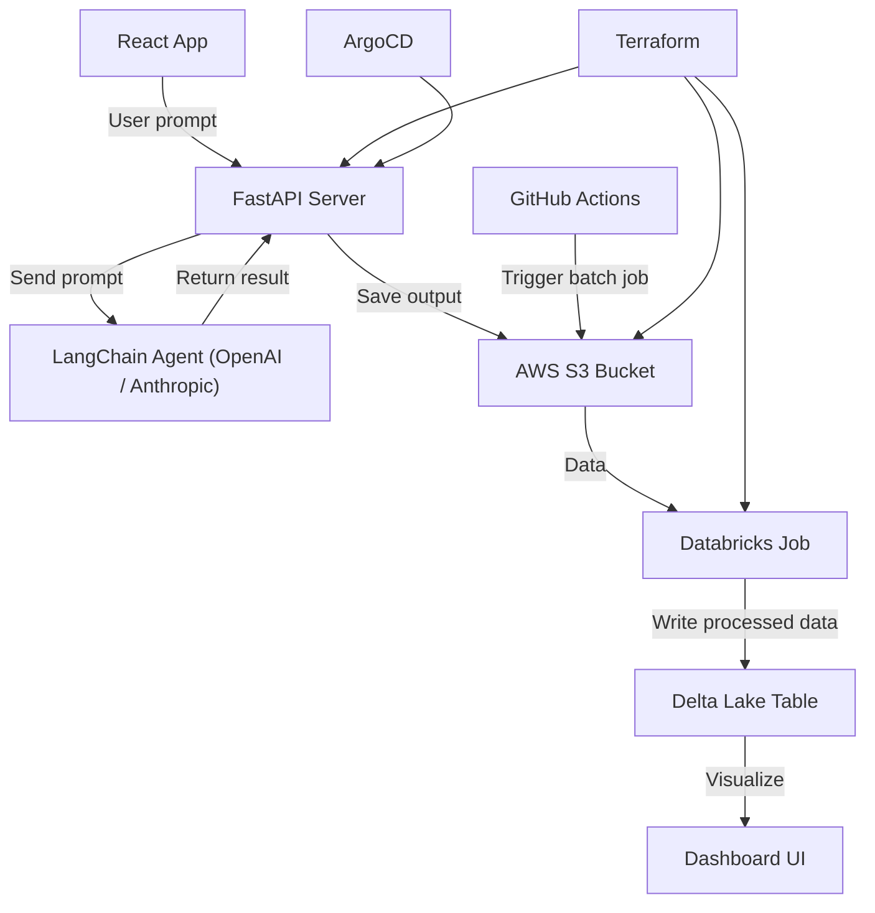

# Prompt Pulse
A Lightweight LLM Prompt Evaluation &amp; Monitoring System

Prompt Pulse is a lightweight, production-grade platform to evaluate, score, and monitor LLM prompt responses over time. 

## 🔍 What It Does

- Submit and track LLM prompts
- Run LLMs (e.g., GPT-4) and store responses
- Automatically score responses using LangChain agents
- Track cost, latency, and drift over time
- Store structured data in Databricks Delta Lake
- Deploy with Terraform, schedule with GitHub Actions, manage infra with ArgoCD

## ⚙️ Tech Stack

| Layer      | Stack                                |
|-----------|---------------------------------------|
| Language   | Python                                |
| LLM Agent  | LangChain                             |
| Backend    | FastAPI                               |
| Infra      | AWS (S3, Lambda/ECS), Terraform       |
| Data       | Databricks Delta Lake (Spark, PySpark)|
| CI/CD      | GitHub Actions, ArgoCD                |
| Frontend   | React (optional)                      |

## 📌 Roadmap

- [ ] FastAPI LLM run + scoring service
- [ ] Databricks Delta ingestion pipeline
- [ ] Terraform AWS infrastructure
- [ ] Scheduled CI (daily evals)
- [ ] Dashboard frontend (basic)

## Architecture 

